# Vel-O-Vit

**A Vision Transformer for automated seismic velocity picking from CMP gathers.**

Vel-O-Vit predicts stacking (RMS) velocity directly from common-midpoint (CMP) gathers, automating a step in seismic data processing that is conventionally done by manually picking velocities from semblance/velocity spectra. A 1D-convolution + patch-embedding + Transformer-encoder architecture is trained to regress the velocity function per gather, and is benchmarked against a ConvLSTM baseline and manual expert picks.

> **Publication status:** A manuscript describing this work is currently under review — we are awaiting the outcome of peer review.

> **Code availability:** The Vel-O-Vit implementation has been licensed to [Oil India Limited](https://www.oil-india.com/) under a signed NDA and **cannot be publicly shared**. This repository accordingly contains only the architecture diagrams and result figures from the study, for demonstration purposes.

## Architecture

Vel-O-Vit encodes each gather with a 1D convolutional stem, patchifies the resulting sequence, adds a learned positional embedding, and passes it through a Transformer encoder before decoding back to a per-sample velocity trace with a convolutional decoder and a residual connection:

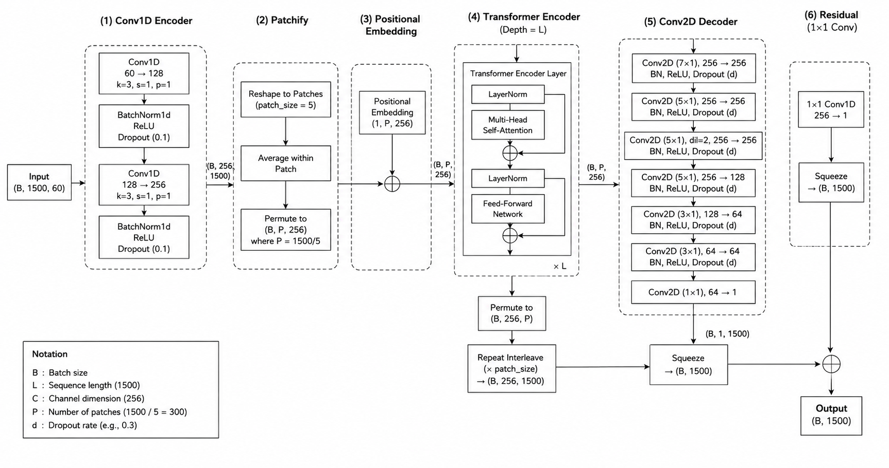

It is compared against a ConvLSTM + recursive-CNN baseline that regresses a single RMS velocity vector per gather:

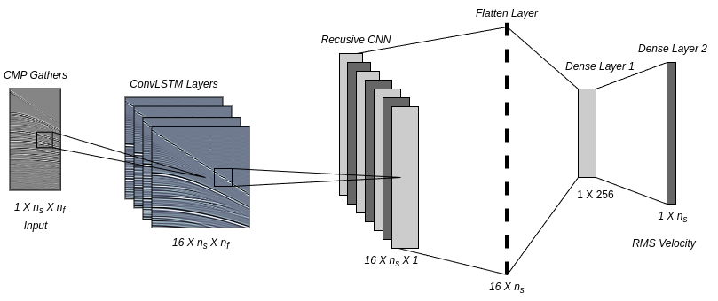

## Training

Both models are trained on a suite of synthetic velocity models spanning flat layers, dipping beds, folds, faults, and localized anomalies (channels, domes, diapirs):

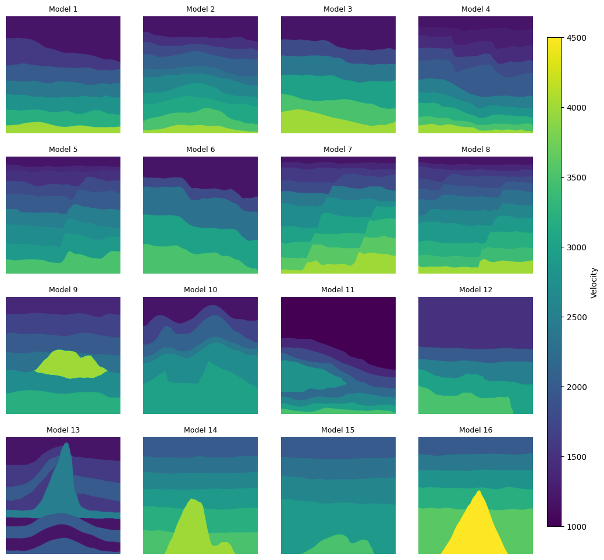

Training/validation loss for both models over their respective training runs:

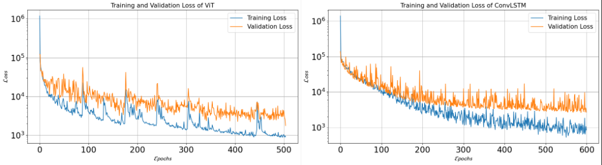

## Results

Each dataset below is evaluated the same way: a manual velocity pick is compared against the ConvLSTM and ViT predictions on the velocity/semblance spectrum, and the resulting stacked sections and/or recovered velocity fields are compared.

### Synthetic data

| CMP gather examples |
|---|
|  |

| Manual vs. ConvLSTM vs. ViT velocity pick on the semblance spectrum |
|---|
| 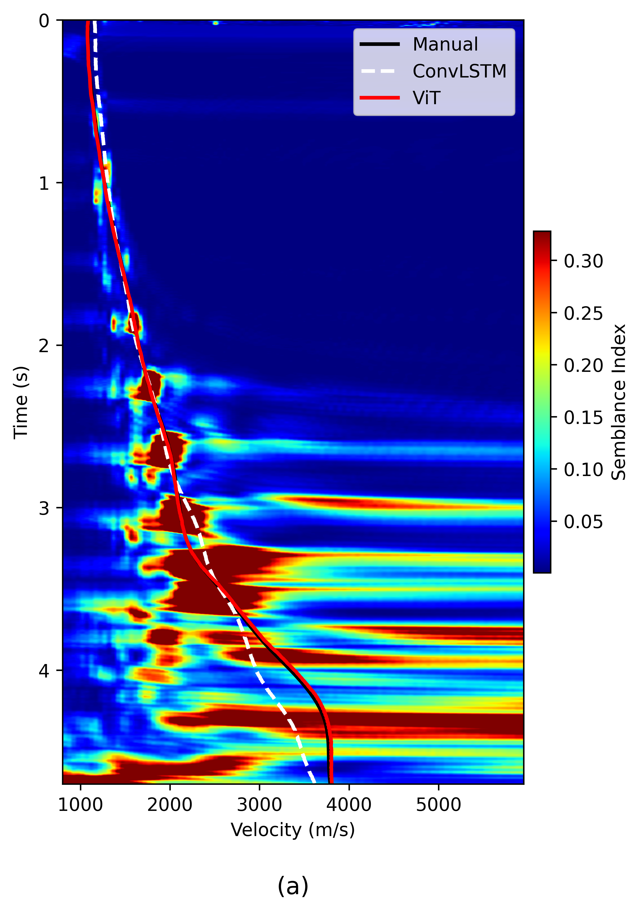 |

| Stacked sections | Recovered velocity fields |
|---|---|
| 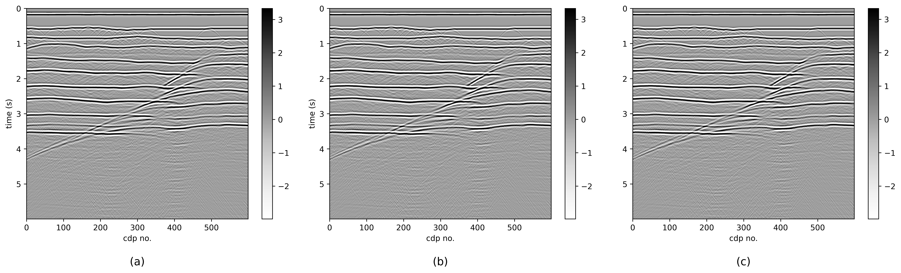 |  |

### Marmousi model

| Manual vs. ConvLSTM vs. ViT velocity picks on two semblance spectra |
|---|---|
|  |
| 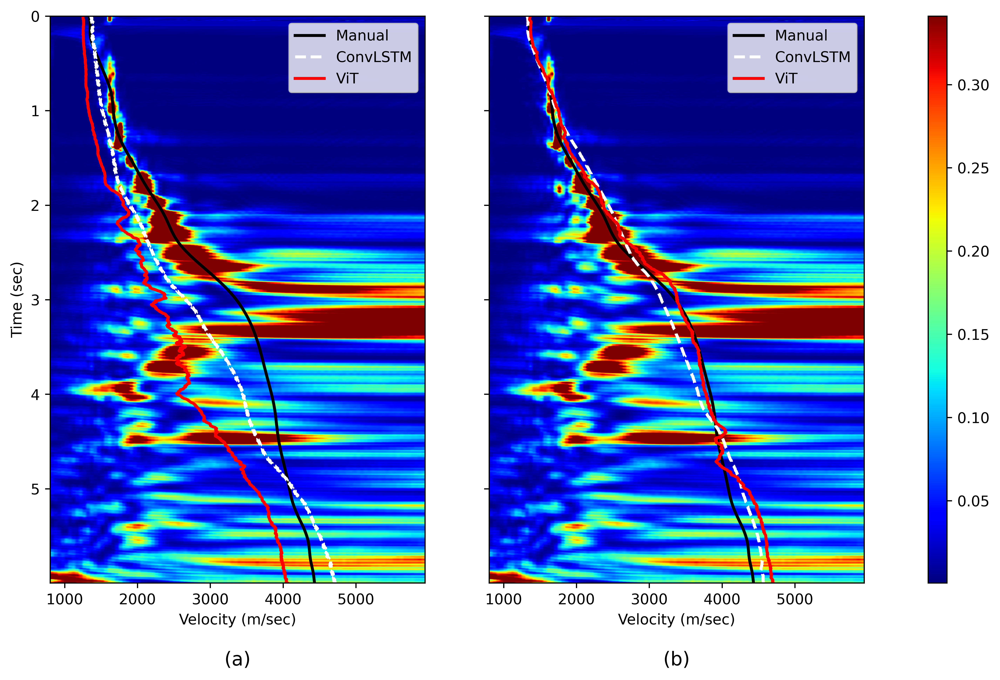 |

| Stacked sections | Recovered velocity fields |
|---|---|
| 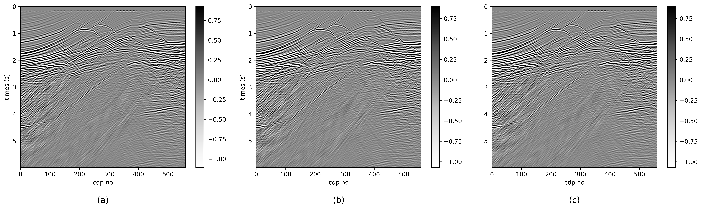 |  |

### Field data — Poland

| Manual vs. ConvLSTM vs. ViT velocity picks on two semblance spectra |
|---|---|
|  |
| 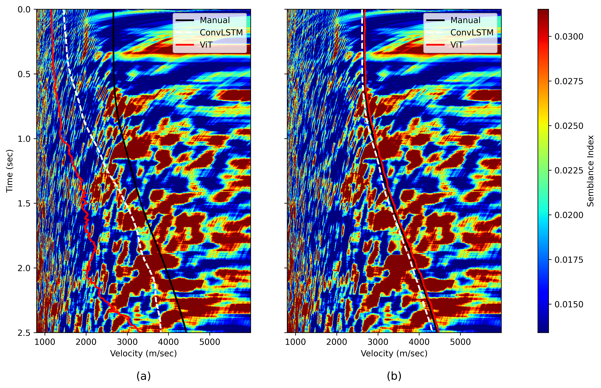 |

| Recovered velocity field | Stacked sections |
|---|---|
| 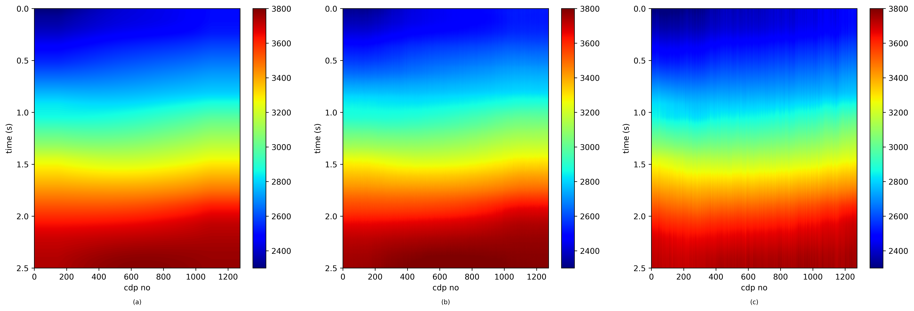 |  |

### Field data — Marine

| Manual vs. ConvLSTM vs. ViT velocity picks on two semblance spectra |
|---|---|
|  |
| 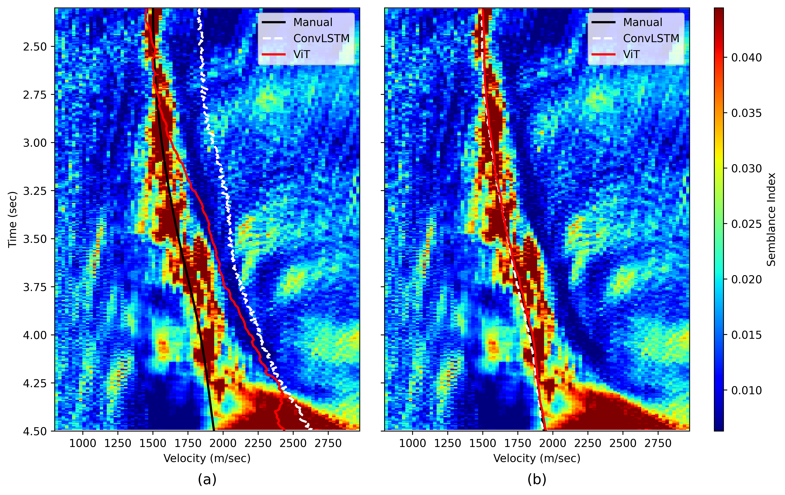 |

| Recovered velocity field | Stacked sections |
|---|---|
| 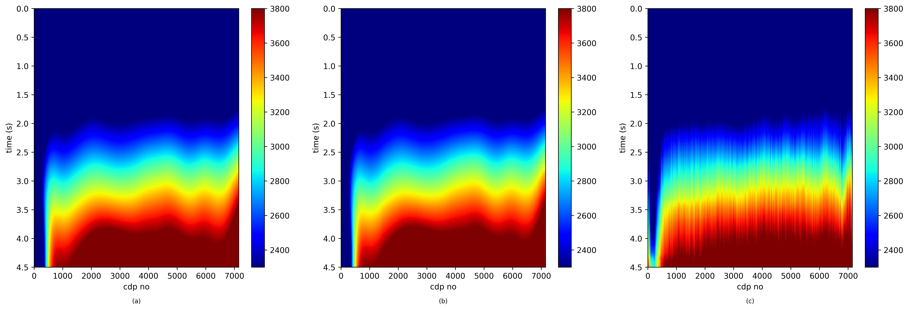 |  |

## Repository structure

```
Vel-O-Vit/
├── figure/
│   ├── 01_ViT.png                       # Vel-O-Vit architecture
│   ├── 02_CONVLSTM.png                  # ConvLSTM baseline architecture
│   ├── 03_Loss_Diagram_During_training.png
│   ├── 04_Velocity_Grid.png             # synthetic training velocity models
│   ├── 05_Synthetic_Data/
│   ├── 06_Marmousi_Data/
│   ├── 07_Poland_data/
│   └── 08_Marine_data/
└── LICENSE
```

## Data & code availability

The Marmousi model is a standard public-domain synthetic benchmark. The Poland and Marine datasets are proprietary field data supplied under the Oil India Limited engagement and are **not included** in this repository. Source code, training data, and trained model weights are withheld under the terms of that NDA; this repository contains only figures illustrating the method and results.

## License

The figures in this repository are released under the terms of the [LICENSE](LICENSE) file. This license covers the documentation and figures only — it does not extend to the (unpublished) source code, model weights, or underlying datasets, which remain proprietary and are not covered by this repository.
